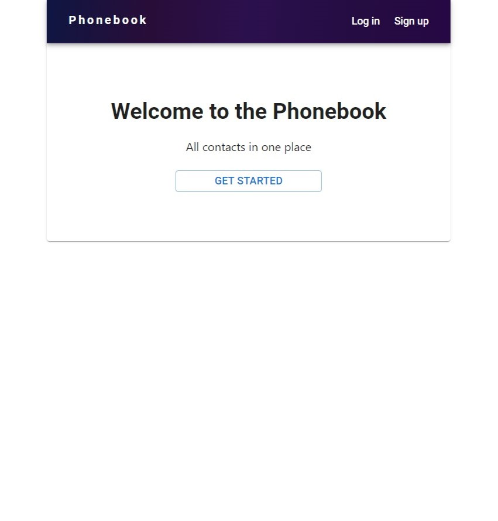
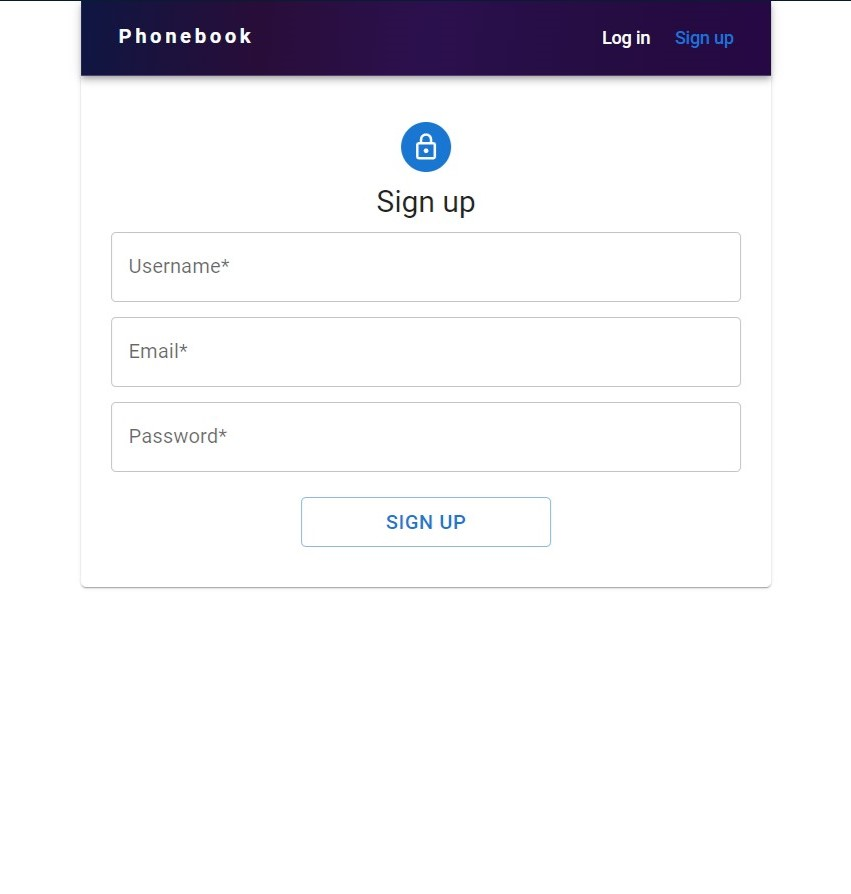
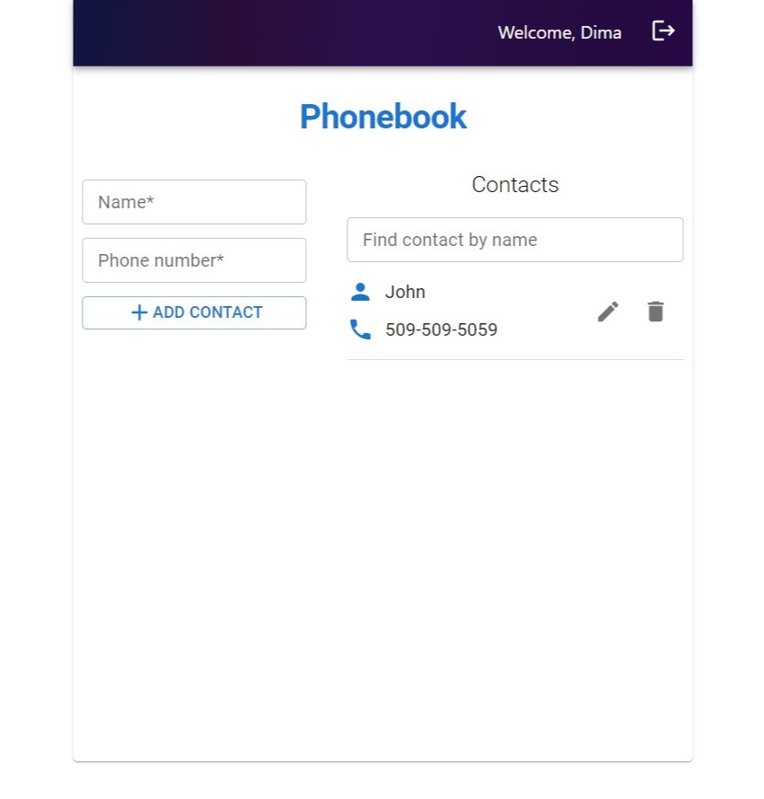
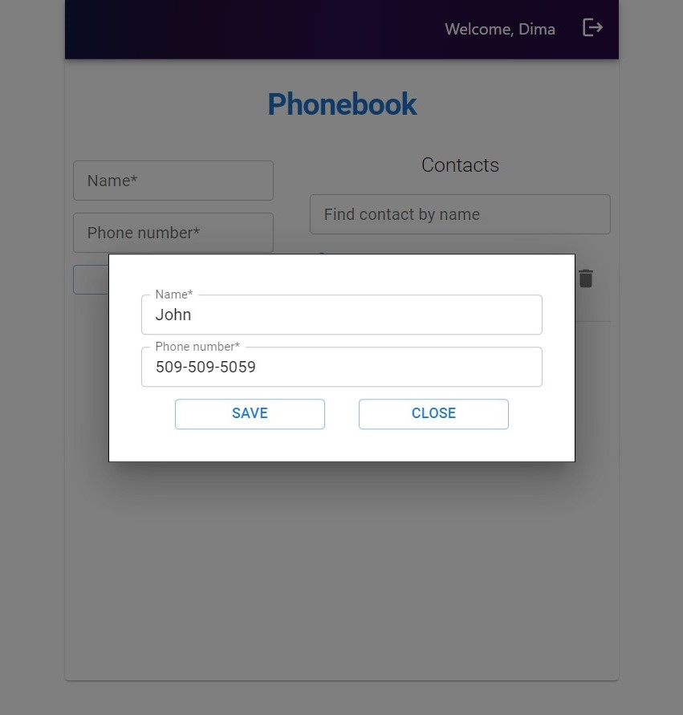

# Phonebook app

**Technology stack** - [React, JS, CSS in (@emotion/styled), Redux, Axios, JWT
Auth, REST API]

## API

[**API Documentation**](https://connections-api.herokuapp.com/docs/)

## About

Individual project

The phonebook application helps save your own private collection of contacts.

Register and log in to your account, add/delete contacts, filter contacts by
name for a fast search.

Each form field is validated before requesting the server. In case of successful
or rejected requests to the server, the user receives notifications in the form
of pop-up windows.

## Overwiev

The base URL address of the application always welcomes users.

To manage your contacts, each user must register or log in to an existing
profile.

The general view of the main Phonebook page where you can see a list of all
contacts. Add new ones, delete unnecessary ones, filter by name and edit a
contact.

A modal window with a form opens for editing a contact.

